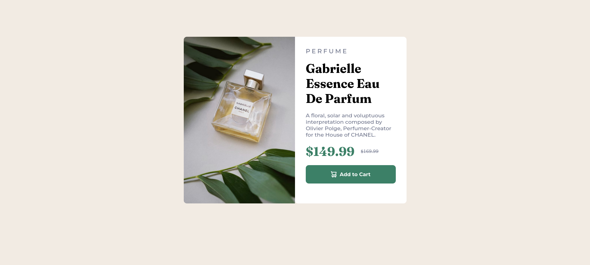

# Frontend Mentor - Product Preview Card Component

This is a solution to the [Recipe page challenge on Frontend Mentor](https://www.frontendmentor.io/challenges/recipe-page-KiTsR8QQKm). Frontend Mentor challenges help you improve your coding skills by building realistic projects.

## Table of contents

- [Overview](#overview)
  - [Screenshot](#screenshot)
  - [Links](#links)
- [My process](#my-process)
  - [Built with](#built-with)
  - [What I learned](#what-i-learned)
- [Author](#author)

## Overview

### Screenshot

### Links

- [Solution URL](https://github.com/lutfiismail52/product-preview-card-component/)
- [Live Site URL](https://lutfiismail52.github.io/product-preview-card-component/)

## My process

### Built with

- Semantic HTML5 markup
- CSS custom properties
- Mobile-first workflow

### What I learned

1. Using the `<del>` tag to make a text strikethrough, as in this project example. It is used for text promos.
2. I need to learn more about using the `<picture>` tag to display different images based on certain conditions, such as screen size or browser supported image formats. This makes the images more responsive.

## Author

- Frontend Mentor - [@lutfiismail52](https://www.frontendmentor.io/profile/lutfiismail52)
- YouTube - [@kodedusk](https://www.youtube.com/@kodedusk)
- Instagram - [@lutfiismail47](https://www.instagram.com/lutfiismail47)
- Medium - [@lutfiismail47](https://medium.com/@lutfiismail47)
